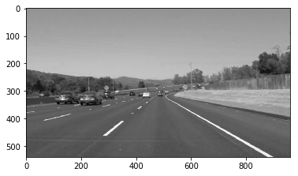
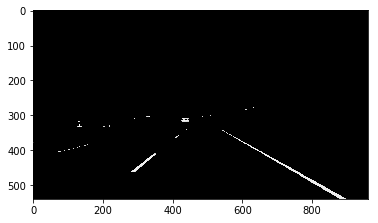
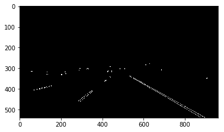
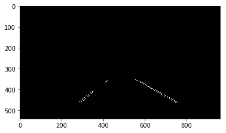
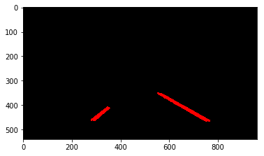
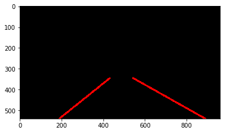
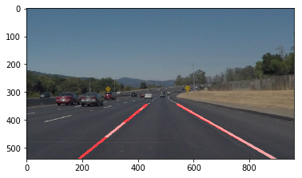

# **Finding Lane Lines on the Road**

## Project Writeup

---

### Reflection

### 1. Pipeline Description

My pipeline for image processing can be found in the function definition "#process_image". It consists of 9 major steps:

1. *Grayscale:* The image is first converted to a grayscale image
2. *Threshold:* Any values less than 200 are set to 0 in the image. This is because the features we are interested in (yellow and white lane lines) tend to be quite bright. Thresholding can help us prevent false positives that occur later in the pipeline such as detecting edges on gray roadside barriers.
3. *Gaussian Blur:* A Gaussian blur with a kernel size of 5 is applied in order to remove noise from the image that could be mistaken for a feature later in the pipeline.
4. *Canny:* The next step is Canny edge detection. We set a high threshold of 200 and a low threshold of 100. I arrived at these values through experimentation. The edges in our lane lines have steep gradients.
5. *Region Mask:* We next apply a mask over a particular part of the image where we believe the lane lines will occur. This is done in order to eliminate false features that may appear in irrelevant parts of the image.
6. *Hough Transform:* We do a Hough transform with rho = 2, threshold = 30, min_line_len = 10, and max_line_gap = 10. These values were also arrived at by experimenting with the provided images.
7. *Averaging Sub-lines:* This step in performed within the Hough helper function. Rather than have the abundance of line features produced by the Hough Transform, we'd really like to just have 2 lines — a left lane line and a right lane line. We can group sub-lines into left and right, and then average across them to compute our final 2 lines. I used a weighted average (by sub-line length) so that longer lines carry more authority in the final outcome.
8. *Buffer:* The previous steps would be sufficient to produce 2 lane lines that track the line features in our images. However, in video, the result ends up being quite "jumpy" since lane line positions are being computed from scratch in each frame. We can take advantage of the knowledge that real road lanes tend to move about gradually. Rather than compute line positions from scratch, we average the last several line positions in prior frames and use that to compute the new frame's line position. The result is smoother and less susceptible to individual distorted images.
9. *Image Overlay:* The last step is simply to apply our lines to the original image to produce our final visual.

###The following images demonstrate several steps in the pipeline:

*Grayscale*  

*Threshold*  

*Canny*  

*Region Mask*  

*Hough Transform*  

*Averaging Sub-lines*  

*Image Overlay*  

### 2. Potential shortcomings of my current pipeline

There are several shortcomings of my pipeline. My pipeline would not work in night-time conditions, for example, because various threshold assumptions would not be suitable. My pipeline also would not work well for changing lanes. In a lane-changing scenario, you need to keep track of the lines for the adjacent lane in addition to your own. Additionally, my pipeline can only produce straight lines. For any sharp turns, my lines would not be a useful representation of the lane boundaries.

### 3. Possible improvements to my pipeline

The short-comings described above could be overcome by adding additional features to my pipeline. Night-time driving is a difficult challenge, but ambient light levels could be measured and different sets of parameters or even equations for parameters could be used to adjust thresholds for a given light level. For lane-changing, we would need to add the ability to track adjacent lanes as well. We may be able to compute a distance between the lines in our lane and use that to determine if there is a lane adjacent to us, and if so, track that lane. For tracking better in turns, a 2 splines could be fit for the left and right lane lines, rather than using a line.
